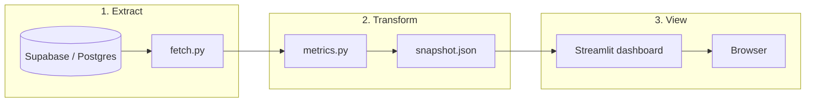

# Building a Snapshot Dashboard (Supabase → JSON → Streamlit)

A practical guide for teams who want a **local, repeatable metrics dashboard** without standing up a BI stack. This pattern is what we use in the Oasis CS agent repo; you can copy the structure for any Postgres/Supabase product.

---

## What you are building

Three layers, kept separate on purpose:



| Layer | Runs when | Talks to DB? | Output |
|-------|-----------|--------------|--------|
| **Extract** | `--baseline` (or cron) | Yes | Python dataclasses / DataFrames |
| **Transform** | Same job | No (in-memory) | `baseline_snapshot.json` |
| **View** | `--baseline-view` | **No** | Charts in browser |

**Why snapshot + viewer?**

- Dashboard loads in milliseconds; works offline after a run.
- Metric definitions live in one Python module — not duplicated in SQL and UI.
- Safe to share JSON internally; no live DB credentials in Streamlit.
- Easy to diff snapshots in git (optional) or archive weekly exports.

---

## Prerequisites

- Python 3.9+ and a project venv
- Read access to your database (Supabase **service role** for server-side scripts only — never commit the key)
- A list of metrics you can define in plain language (see below)
- `pandas` for cohort math; `streamlit` for the UI

---

## Step 1 — Define metrics before code

Write a short spec table. Example (Oasis):

| Section | Metric | Definition |
|---------|--------|------------|
| Activation | Time to first prompt | Hours from `users.created_at` to first `llm_usage` row |
| Activation | % activated in 24h | Users with first prompt ≤ 24h after signup / all users |
| Retention | D7 | % of signups with **session OR llm_usage** on calendar day signup+7 |
| Engagement | Power users (day 0) | % with ≥ N prompts on signup day |
| Monetization | ARPU | Total revenue / active users in period |

**Decide retention “return” once.** We count a return if **either** a session or an LLM usage row exists on that calendar day. Document it in `limitations` in the JSON so readers do not misinterpret.

Add a `limitations: string[]` field in the snapshot for sample size, missing tables, or metrics you cannot compute yet (e.g. CAC/LTV without spend data).

---

## Step 2 — Project layout

```
your-repo/
  db/
    client.py          # Supabase client from env
    fetch.py           # fetch_users, fetch_sessions, ...
  models/
    db.py              # Pydantic/dataclass row types
  reporting/
    baseline_metrics.py   # pure computation → BaselineSnapshot
    cost_model.py         # optional: API cost estimates
    run_baseline.py       # orchestrate fetch → compute → write JSON
    dashboard.py          # Streamlit; reads JSON only
    launch_dashboard.py   # subprocess wrapper for CLI
    baseline_snapshot.json  # generated artifact
  .streamlit/
    config.toml          # showEmailPrompt = false, etc.
  main.py                # --baseline, --baseline-view
  docs/
    BUILDING_A_SNAPSHOT_DASHBOARD.md  # this file
```

Keep **all business logic** in `baseline_metrics.py`. The dashboard should only map JSON keys to `st.metric`, `st.bar_chart`, and `st.dataframe`.

---

## Step 3 — Extract layer (`db/fetch.py`)

1. Load secrets from `.env` (`SUPABASE_URL`, `SUPABASE_KEY`).
2. One function per table or logical query.
3. Return typed models, not raw dicts everywhere.

```python
def fetch_users() -> list[User]:
    ...
```

**Tips**

- Paginate large tables (Supabase `.range()`).
- Fetch once per baseline run; pass lists into metrics — do not re-query per metric.
- For local dev without credentials, support rebuilding from a frozen `sql_export.json` (see `reporting/build_snapshot.py` in this repo).

---

## Step 4 — Transform layer (`reporting/baseline_metrics.py`)

1. Define a `@dataclass BaselineSnapshot` with sections: `activation`, `engagement`, `retention`, `monetization`, `feedback`, `validation`.
2. Use pandas for joins, cohort weeks, and retention matrices.
3. Expose `compute_baseline_snapshot(users, sessions, usage, ...) -> BaselineSnapshot`.
4. Implement `to_dict()` and write JSON with `json.dump(..., indent=2)`.

**Validation block** — optional but useful: row counts, date ranges, % null signup dates. Surfaces data bugs before someone trusts a chart.

---

## Step 5 — Orchestration (`reporting/run_baseline.py`)

Single entry that:

1. Fetches all inputs
2. Calls `compute_baseline_snapshot`
3. Writes `reporting/baseline_snapshot.json`
4. Logs: `View dashboard: .venv/bin/python main.py --baseline-view`

Wire in `main.py`:

```python
parser.add_argument("--baseline", action="store_true")
parser.add_argument("--baseline-view", action="store_true")
```

---

## Step 6 — Streamlit viewer (`reporting/dashboard.py`)

Rules:

- `SNAPSHOT_PATH = Path(__file__).parent / "baseline_snapshot.json"`
- `@st.cache_data` on `load_snapshot()` for fast reruns
- Sidebar: command to refresh data + **Rerun** button that clears cache
- One `st.header` per JSON section; match field names from the snapshot schema
- No Supabase imports in this file

**Section → widget cheat sheet**

| Data shape | Streamlit |
|------------|-----------|
| Single numbers | `st.columns` + `st.metric` |
| Label → value map | `pd.Series` → `st.bar_chart` |
| Time series | `st.line_chart` |
| Cohort table | `st.dataframe` |
| Long text / samples | `st.dataframe` or expander |

Limit chart cardinality (e.g. last 8–12 cohort weeks) so the UI stays readable.

---

## Step 7 — First-run Streamlit gotcha

On first launch, Streamlit may block on an **email prompt** and exit before binding port 8501.

Add to **project** `.streamlit/config.toml`:

```toml
[browser]
gatherUsageStats = false

[server]
showEmailPrompt = false
headless = false
```

Pass `--server.showEmailPrompt false` in `launch_dashboard.py` as well.

**Important:** Opening `http://localhost:8501` only works while a terminal is running the server. Users must run `--baseline-view` and leave that terminal open.

---

## Step 8 — CLI launch helper

`reporting/launch_dashboard.py`:

- Check snapshot exists; print helpful error if not
- `subprocess.call([sys.executable, "-m", "streamlit", "run", "reporting/dashboard.py", ...])`
- `cwd` = repo root

---

## Step 9 — Dependencies

In `pyproject.toml`:

```toml
dependencies = [
  "pandas>=2.0",
  "streamlit>=1.40",
  "python-dotenv>=1.0",
  "supabase>=2.0",
  ...
]
```

Install: `.venv/bin/pip install -e .` or `pip install streamlit pandas ...`

---

## Step 10 — Docs and handoff

Give your team two commands:

```bash
# Refresh metrics (needs .env)
.venv/bin/python main.py --baseline

# View dashboard (keep terminal open)
.venv/bin/python main.py --baseline-view
```

Add `reporting/README.md` with the same commands and a file table.

---

## Optional: Cursor Canvas

You can **generate** a `.canvas.tsx` from the same JSON for Cursor IDE preview. Treat it as secondary:

- Canvas preview in Cursor often requires files under `.cursor/projects/.../canvases/`
- In-repo `canvases/` is good for version control; Streamlit is the reliable viewer for everyone

Do not maintain chart logic in both places — inject `__SNAPSHOT_JSON__` into a template string in `run_baseline.py`.

---

## Checklist for a new project

- [ ] Metric spec written (definitions + retention rule)
- [ ] `db/fetch.py` + typed models
- [ ] `baseline_metrics.py` with `BaselineSnapshot` dataclass
- [ ] `run_baseline.py` writes JSON
- [ ] `dashboard.py` reads JSON only
- [ ] `.streamlit/config.toml` with `showEmailPrompt = false`
- [ ] `main.py` flags `--baseline` and `--baseline-view`
- [ ] `.env.example` with placeholders; real `.env` gitignored
- [ ] `reporting/README.md` for operators
- [ ] Smoke test: run baseline → start Streamlit → HTTP 200 on :8501

---

## Extending the system

| Need | Approach |
|------|----------|
| New metric | Add to `baseline_metrics.py` + one dashboard section |
| Daily automation | GitHub Action cron: `--baseline`, upload JSON artifact |
| Compare weeks | Write `baseline_snapshot_YYYY-MM-DD.json`; add date picker in Streamlit |
| Production hosting | Deploy Streamlit Cloud **or** export static HTML; keep compute job separate |
| Live DB in UI | Avoid for ops dashboards; use snapshot for auditability |

---

## Reference implementation

This repository: [oasis-cs-agent](.)

| File | Role |
|------|------|
| `reporting/baseline_metrics.py` | All metric math |
| `reporting/run_baseline.py` | Pipeline + optional canvas |
| `reporting/dashboard.py` | Streamlit UI |
| `reporting/launch_dashboard.py` | CLI launcher |
| `main.py` | `--baseline`, `--baseline-view` |
| `reporting/README.md` | Operator quick start |

---

## Anti-patterns to avoid

1. **Querying Supabase inside Streamlit** — couples viewer to credentials and slows every interaction.
2. **SQL metrics + Python metrics** — two sources of truth diverge quickly.
3. **Huge JSON in git** — fine for small teams; for large data use CI artifacts or object storage.
4. **Service role key in frontend** — server scripts only.
5. **Opening localhost without starting the server** — always document the two-step flow.

---

## Minimal timeline estimate

| Phase | Effort |
|-------|--------|
| Fetch + models | 0.5–1 day |
| Core metrics (activation + retention) | 1–2 days |
| Streamlit dashboard | 0.5 day |
| Monetization / feedback sections | 0.5–1 day each |
| Polish + docs | 0.5 day |

Start with **one section** (e.g. activation) end-to-end: fetch → JSON → one chart. Add sections incrementally using the same snapshot file.
