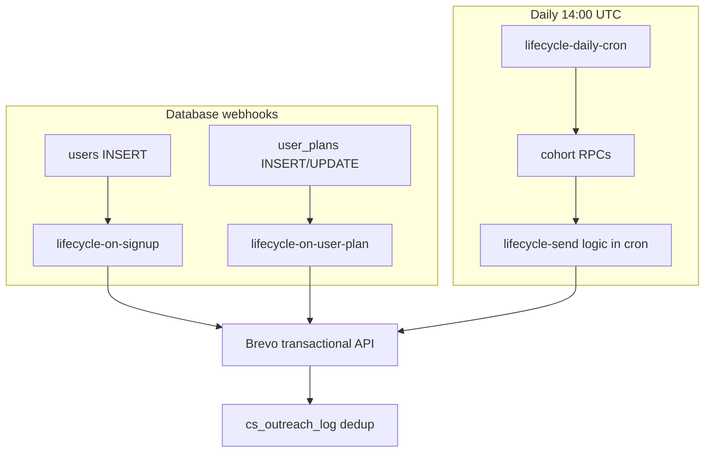

# Lifecycle email — pre–Product Hunt QA handbook

**Audience:** Engineer validating the full Oasis lifecycle email system **the day before PH launch**.

**Monitoring UI:** [oasis-analytics dashboard](https://oasis-analytics.vercel.app/) · [Email Machine → Supabase lifecycle](https://oasis-analytics.vercel.app/email-machine#supabase-lifecycle) · [Launch QA strip](https://oasis-analytics.vercel.app/#launch-qa)

**PH-week ops (after launch):** [`LIFECYCLE_PH_LAUNCH_MONITORING.md`](LIFECYCLE_PH_LAUNCH_MONITORING.md)

---

## Prerequisites (confirm before testing)

| Item | Where to verify |
|------|-----------------|
| Supabase project | `wvclepquxxczgrukfqyr` (Oasis production) |
| Service role key | Dashboard → Settings → API (for curls below) |
| `cs_outreach_log` table | SQL: `select count(*) from cs_outreach_log` |
| Phase 2 SQL migration | Functions like `lifecycle_cohort_limit_hitter_upgrade` exist |
| Edge Functions deployed | `lifecycle-send`, `lifecycle-on-signup`, `lifecycle-daily-cron`, `lifecycle-on-user-plan` |
| Edge secrets | `BREVO_API_KEY`, `BREVO_TEMPLATE_ID_*` (54–72), `LIFECYCLE_SENDER_*` |
| Webhook: `users` INSERT | → `lifecycle-on-signup` |
| Webhook: `user_plans` INSERT + UPDATE | → `lifecycle-on-user-plan` |
| pg_cron | `lifecycle-daily-cron` @ **14:00 UTC** |
| Brevo templates | **54–72** pasted with opener **`{{ params.GREETING }}`** (not `contact.FIRSTNAME`) |
| Vercel dashboard | Env `SUPABASE_URL` + `SUPABASE_KEY` on oasis-analytics |

Set env for local curls (repo `.env`):

```bash
export SUPABASE_URL="https://wvclepquxxczgrukfqyr.supabase.co"
export SUPABASE_KEY="<service_role_key>"
```

---

## Architecture (what runs automatically)



| Channel | Triggers |
|---------|----------|
| **Webhook** | `welcome_email`, `upgrade_thank_you`, `cancelled_winback` |
| **Daily cron** | Phase 1: nudge, CS calendar, NPS, PMF · Phase 2: limit-hitter, at-risk, dead, return, enterprise, cancelled D14 |

**Not automated:** `legal_notice`, `incident_notice` — manual [`scripts/send_operational.py`](../scripts/send_operational.py) only.

---

## Pass/fail test matrix

Use a **dedicated test user** email you control (must exist in `users`). Replace `TEST@example.com` below.

### A. Webhook — signup welcome

| Step | Command / action | Pass |
|------|------------------|------|
| Dry-run | See [lifecycle-send dry-run](#helper-lifecycle-send) with `welcome_email` | JSON `dry_run: true`, no Brevo send |
| Live (optional) | Same without `dry_run`; use `force: true` only if re-testing | Email received; `cs_outreach_log.trigger_name = welcome_email` |
| Production path | Create test signup in Oasis app | Row within minutes |

### B. Webhook — paid plan

| Step | Command / action | Pass |
|------|------------------|------|
| Upgrade | `lifecycle-send` → `upgrade_thank_you` (dry-run then live) | Template **59** Oasis Paid Zen Welcome |
| Cancel | `lifecycle-send` → `cancelled_winback` or deactivate `user_plans` | Template **62**; log row `cancelled_winback` |
| Dedup | Repeat same trigger | `skipped: already_sent` |

### C. Cron — Phase 1 (one trigger at a time)

| Trigger | Brevo template ID | Dry-run cron body |
|---------|-------------------|-------------------|
| `activation_nudge_24h` | 55 | `{"dry_run":true,"limit":10,"triggers":["activation_nudge_24h"]}` |
| `activation_cs_calendar` | 58 | `…"activation_cs_calendar"` |
| `nps_day3` | 56 | `…"nps_day3"` |
| `pmf_day10` | 57 | `…"pmf_day10"` |

**Pass:** HTTP 200, `results[]` includes `cohort_size` (may be 0) and per-user `dry_run: true` or `skipped` with reason.

### D. Cron — Phase 2

| Trigger | Template ID | Notes |
|---------|-------------|--------|
| `limit_hitter_upgrade` | 60 | User must have hit daily token cap |
| `limit_hitter_upgrade_d7` | 61 | 7d after D0 send |
| `at_risk_nurture_d0` … `d21` | 64–67 | User in at-risk bucket today |
| `dead_resurrection_d0` | 68 | Cap **20 new/month** |
| `dead_resurrection_d14` | 69 | 14d after D0 |
| `return_reinforcement` | 70 | Bucket transition to reactivated/resurrected |
| `enterprise_founder` | 71 | Company email, day 7–8, ≥2 sessions |
| `enterprise_expansion` | 72 | Company email, day 14–15, ≥4 sessions |
| `cancelled_winback_d14` | 63 | 14d after `cancelled_winback` |

Dry-run each with `triggers: ["<name>"]` in [cron curl](#helper-daily-cron).

### E. Ad hoc (document only)

```bash
.venv/bin/python scripts/send_operational.py --template legal --dedup-key qa_legal_test --dry-run
.venv/bin/python scripts/send_operational.py --template incident --dedup-key qa_incident_test --dry-run
```

**Pass:** Dry-run prints recipient count; no requirement to send before PH.

---

## Helper: lifecycle-send

```bash
curl -sS -X POST "$SUPABASE_URL/functions/v1/lifecycle-send" \
  -H "Authorization: Bearer $SUPABASE_KEY" \
  -H "Content-Type: application/json" \
  -d '{"trigger_name":"upgrade_thank_you","email":"TEST@example.com","dry_run":true}'
```

Live send (dedup applies): omit `dry_run`. Re-test: add `"force": true`.

---

## Helper: daily cron

```bash
curl -sS -X POST "$SUPABASE_URL/functions/v1/lifecycle-daily-cron" \
  -H "Authorization: Bearer $SUPABASE_KEY" \
  -H "Content-Type: application/json" \
  -d '{"dry_run":true,"limit":10,"triggers":["activation_nudge_24h"]}'
```

Omit `triggers` to run **all** default triggers (Phase 1 + Phase 2).

---

## Verification SQL

```sql
-- Recent sends by trigger
select trigger_name, count(*) as n, max(sent_at) as last_send
from cs_outreach_log
where channel = 'email'
group by trigger_name
order by trigger_name;

-- One user’s history
select trigger_name, sent_at, message_preview
from cs_outreach_log
where user_id = '<uuid>'
order by sent_at desc;

-- Cron ran recently
select j.jobname, d.status, d.start_time, d.end_time
from cron.job_run_details d
join cron.job j on j.jobid = d.jobid
where j.jobname = 'lifecycle-daily-cron'
order by d.start_time desc
limit 5;
```

---

## Brevo templates — `{{ params.GREETING }}` re-paste

Opener in HTML must be **`{{ params.GREETING }}`** (Edge sends `GREETING`, `FIRSTNAME`, `EMAIL`).

| ID | Brevo name | Repo HTML |
|----|----------|-----------|
| 54 | Oasis Welcome | `brevo-oasis-emails/lifecycle/brevo-oasis-welcome.html` |
| 55 | Oasis Activation Nudge | `brevo-oasis-emails/lifecycle/brevo-oasis-activation-nudge.html` |
| 58 | Oasis Activation CS Calendar | `brevo-oasis-emails/lifecycle/brevo-oasis-activation-cs-calendar.html` |
| 56 | Oasis NPS | `brevo-oasis-emails/lifecycle/brevo-oasis-nps-day3.html` |
| 57 | Oasis PMF | `brevo-oasis-emails/lifecycle/brevo-oasis-pmf-day10.html` |
| 59 | Oasis Paid Zen Welcome | `brevo-oasis-emails/lifecycle/brevo-oasis-paid-zen-welcome.html` |
| 60 | Oasis Limit Hitter D0 | `brevo-oasis-emails/lifecycle/brevo-oasis-limit-hitter-upgrade.html` |
| 61 | Oasis Limit Hitter D7 | `brevo-oasis-emails/lifecycle/brevo-oasis-limit-hitter-upgrade-d7.html` |
| 62 | Oasis Cancelled Win-back D0 | `brevo-oasis-emails/lifecycle/brevo-oasis-cancelled-winback-d0.html` |
| 63 | Oasis Cancelled Win-back D14 | `brevo-oasis-emails/lifecycle/brevo-oasis-cancelled-winback-d14.html` |
| 64–67 | Oasis At-risk D0–D21 | `brevo-oasis-emails/conversion/brevo-oasis-at-risk-nurture-d*.html` |
| 68–69 | Oasis Dead Resurrection D0/D14 | `brevo-oasis-emails/conversion/brevo-oasis-dead-resurrection-*.html` |
| 70 | Oasis Return Reinforcement | `brevo-oasis-emails/conversion/brevo-oasis-return-reinforcement.html` |
| 71–72 | Oasis Enterprise Founder/Expansion | `brevo-oasis-emails/enterprise/brevo-oasis-enterprise-*.html` |

List IDs: `.venv/bin/python scripts/list_brevo_smtp_templates.py`

---

## Dashboard checks (Vercel)

1. Open [dashboard](https://oasis-analytics.vercel.app/) — footer/caption should say **Source: live (Supabase)**.
2. **Key insights** — no critical missed-delivery cards (Phase 1 fully monitored; see limitations).
3. **Email delivery health** — lists Phase 1 + Phase 2 triggers; `Due now` may be 0; `Missed` should be 0 for Phase 1 cohort.
4. **Email Machine** — banner shows Phase 1 + Phase 2 shipped; trigger table has ~19 rows.

---

## Known limitations (do not fail QA for these alone)

| Limitation | Detail |
|------------|--------|
| **500 RPC cap** | Each cron trigger processes max 500 eligible users/run; dashboard shows warning if capped |
| **Dead D0 cap** | Max 20 new `dead_resurrection_d0` per calendar month |
| **Enterprise windows** | Only users on lifecycle days 7–8 or 14–15 with company email |
| **Phase 2 `missed_overdue`** | Dashboard `missed_overdue` is fully computed for Phase 1 triggers only; Phase 2 relies on `eligible_now` RPC + manual log checks |
| **Zero cohort** | Dry-run with `cohort_size: 0` is OK if no users match rules today |
| **Vercel ≠ execution** | Webhooks/cron run on **Oasis Supabase**, not Vercel |

---

## Sign-off

| Group | Tester | Date | Pass? | Notes |
|-------|--------|------|-------|-------|
| A. Welcome webhook | | | | |
| B. Plan webhook | | | | |
| C. Cron Phase 1 | | | | |
| D. Cron Phase 2 | | | | |
| E. Ad hoc scripts | | | | |
| Brevo templates 54–72 | | | | |
| Dashboard live API | | | | |

---

## Related docs

- [`LIFECYCLE_PHASE2.md`](LIFECYCLE_PHASE2.md) — deploy + cohort rules
- [`LIFECYCLE_DAILY_CRON.md`](LIFECYCLE_DAILY_CRON.md) — cron setup
- [`LIFECYCLE_WELCOME.md`](LIFECYCLE_WELCOME.md) — welcome path
- [`SUPABASE_LIFECYCLE_EMAIL_PLAN.md`](SUPABASE_LIFECYCLE_EMAIL_PLAN.md) — architecture spec
- [`VERCEL_DEPLOY.md`](VERCEL_DEPLOY.md) — dashboard deploy
