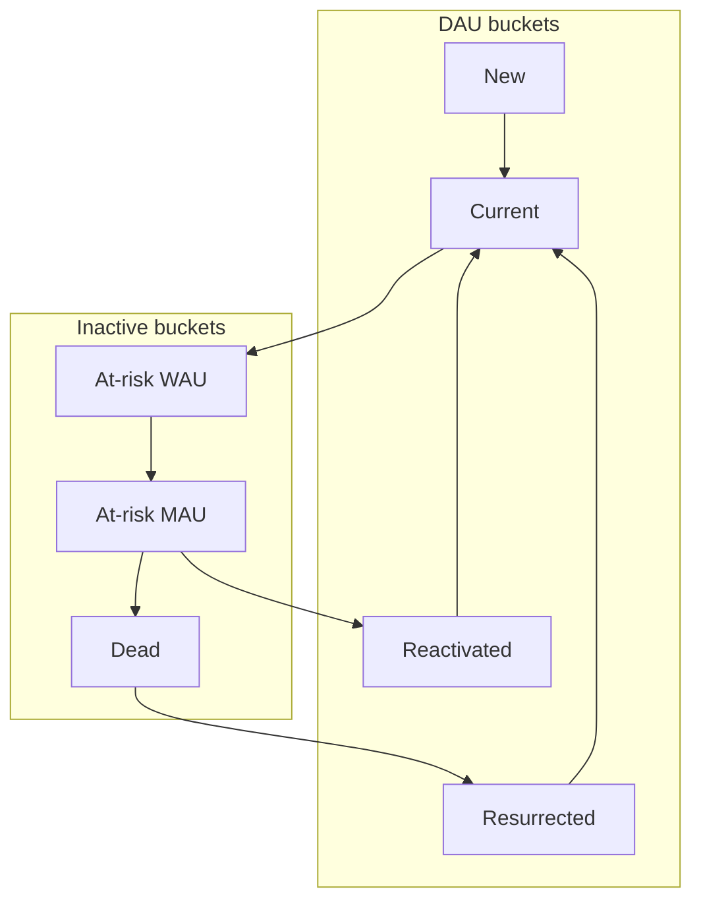
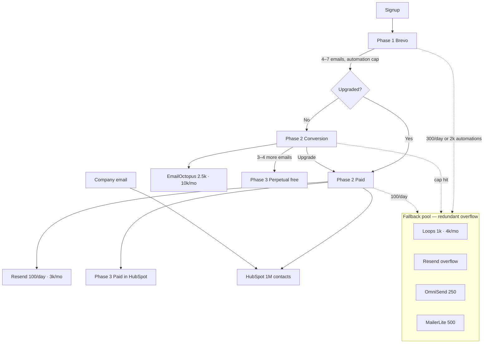

# User Email Machine — Proposal

> **Status:** Draft proposal (strategy spec, not implementation)  
> **Live engineer reference:** `/email-machine` on the Vercel dashboard (`public/email-machine.html`)  
> **Source notes:** [`User Email Machine.txt`](../User%20Email%20Machine.txt)  
> **Dashboard context:** [`Corporate Goals.txt`](../Corporate%20Goals.txt), live metrics via `main.py --baseline`  
> **Baseline snapshot:** 2026-05-24 (`reporting/baseline_snapshot.json`)

---

## 1. Executive summary

Oasis can run a **multi-provider, free-tier email stack** that maps each lifecycle stage to the cheapest provider with capacity left — stretching runway while we pursue **500 paid subscribers by Dec 31, 2026**, **4.5× DAU vs Product Hunt launch week**, and **80% gross margin**.

Adam’s initial five-sequence split is the right foundation, now mapped to a **three-phase Brevo funnel** (free tier) with a **redundant fallback pool** (Loops + Resend + OmniSend + MailerLite — interchangeable, not sequential). **Phase 1** activation on **Brevo** (welcome, browser import, first AI command, AI assistant training — graduated readiness milestones before Phase 2 fork); **Phase 2** forks to Resend + HubSpot (paid interim; replaces blocked Mailgun) or EmailOctopus (3–4 emails, non-upgraders); **Phase 3** terminal — paid in HubSpot or perpetual free (Google sheet + Supabase, 6mo inactive → delete). **Beehiiv** is archived (Launch lacks multi-step automations without Scale). This proposal **preserves Adam’s five sequences** and adds dashboard-driven gaps:

- **Activation nudges** (32% 24h activation today — room to improve NURR before PH)
- **Limit-hitter upgrade** (direct path to paid subs; currently 0% limit-hitter conversion)
- **Dead resurrection** (95 dead users = 77.9% of base; Resurrection_Rate ≈ 0.3%)
- **Cancelled-sub win-back** (post-OmniSend cap at 250 paid)

The daily baseline dashboard (`dau_model` buckets + flow rates + `corporate_goals`) becomes the **control panel** for which cohorts get email slots when free-tier caps are tight.

---

## 2. DAU bucket model primer

The User Email Machine classifies every user into exactly one bucket per day. The top four buckets sum to **DAU**; the bottom three describe inactive users at different depths of churn.



| Bucket | Definition | Email role |
|--------|------------|------------|
| **New** | First day of engagement ever | Onboarding, activation |
| **Current** | Active today + at least one other day in prior 6 | Habit reinforcement (light touch) |
| **Reactivated** | First day back after 7–29 days away | Reinforce return; improve RURR |
| **Resurrected** | First day back after 30+ days away | Reinforce return; improve SURR |
| **At-risk WAU** | Inactive today, active in prior 6 days | Urgent re-engagement → **iWAURR** |
| **At-risk MAU** | Inactive 7+ days, active 7–29 days ago | Win-back before dead → **iMAURR** |
| **Dead** | No activity in 30+ days | Resurrection → **Resurrection_Rate** |

**Roll-ups:** At-risk WAU + DAU = WAU · At-risk MAU + WAU = MAU · Dead + MAU = total user base.

### Flow rates (levers)

These rates appear on the dashboard and in Key insights. Moving them grows DAU compounding over time.

| Rate | Transition | Baseline (May 24) |
|------|------------|-------------------|
| NURR | New → Current | 50.0% |
| 1-NURR | New → At-risk WAU | 50.0% |
| CURR | Current → Current | 25.8% |
| 1-CURR | Current → At-risk WAU | 74.2% |
| iWAURR | At-risk WAU → Current | **18.8%** |
| WAU_Loss_Rate | At-risk WAU → At-risk MAU | 6.0% |
| iMAURR | At-risk MAU → Reactivated | **2.3%** |
| MAU_Loss_Rate | At-risk MAU → Dead | 6.4% |
| Resurrection_Rate | Dead → Resurrected | **0.3%** |

**May 24 bucket snapshot (122 users):**

| Bucket | Count | % of base |
|--------|------:|----------:|
| Dead | 95 | 77.9% |
| At-risk WAU | 16 | 13.1% |
| At-risk MAU | 10 | 8.2% |
| Resurrected | 1 | 0.8% |
| DAU (sum of active buckets) | 1 | — |
| WAU | 17 | — |
| MAU | 27 | — |

**Implication:** Pre–Product Hunt, email priority should be **at-risk prevention** (26 recoverable users) and **resurrection** (95 dead), not broad current-user nurture.

---

## 3. Provider stack — three phases + universal fallback pool

Lifecycle email routes through **three phases**. **Loops, Resend, OmniSend, and MailerLite** form a shared **fallback pool** when **Brevo** (Phase 1), **EmailOctopus** (Phase 2 conversion), or **Resend** (Phase 2 paid) hits cap. See `funnel_phases`, `fallback_pool`, `operational_pool`, and `routing_rules` in `email_sequences.json`.



### Universal fallback pool (redundant)

**Loops, Resend, OmniSend, and MailerLite** are not a waterfall — they function as **one redundant pool**. When **Brevo** (Phase 1), **EmailOctopus**, or **Resend** hits its cap, route overflow to **whichever pool member has headroom**.

| Provider | Free limit | Pool role |
|----------|------------|-----------|
| **Loops** | 4,000/mo · **1,000 contacts** | Pool member — marketing / product-help overflow |
| **Resend** | 100/day · **3,000/mo** | Pool member — API overflow when Brevo daily/monthly full |
| **OmniSend** | 500/mo · **250 contacts** | Pool member — emergency only |
| **MailerLite** | 12,000/mo · **500 contacts** | Pool member — if account recovered |

**Brevo (Phase 1 primary):** 300/day · **2,000 automation entrants** · reserve ~50/day for CS agent (not in fallback pool).

**Aggregate pool headroom:** ~1,750 contacts · ~19,500 sends/mo. Scenario planner shows combined **fallback pool** KPI.

| Provider | Free limit | Pool role |
|----------|------------|-----------|
| **Loops** | 4,000/mo · **1,000 contacts** | Pool member — marketing / product-help fallback (Powered by Loops footer; not legal/outage) |

### Provider account setup (live)

**Source of truth:** `account_setup` on each provider in [`public/email_sequences.json`](../public/email_sequences.json), rendered on [/email-machine#provider-setup](https://oasis-analytics.vercel.app/email-machine#provider-setup) (`provider_setup_meta.as_of`).

This is **not** the same as sequence `implementation_status` (automation shipped vs `needs_implementation`). Account setup tracks whether you can log in, verify domain, and use API keys today.

| Provider | Account status | API key | Notes |
|----------|----------------|---------|-------|
| **Brevo** | Ready | Yes (+ MCP token) | **Phase 1 primary** — 300/day · 2k automation entrants |
| **Beehiiv** | Deprecated | Yes | Archived — Scale required for journeys; MCP read-only |
| **EmailOctopus** | Ready | Yes | 2,500 subs · 10k/mo |
| **Resend** | Ready | Yes | Phase 2 paid interim (replaces Mailgun) + fallback pool |
| **HubSpot** | Ready | — | Phase 3 terminal CRM (portal) |
| **Loops** | Ready | Yes | Lifecycle fallback (not operational) |
| **Amazon SES** | Sandbox | Yes (AWS) | 200/day until production access approved |
| **OmniSend** | Pending verification | — | Domain DNS in progress; 500/mo |
| **MailerLite** | Account recovery | — | Regain login before pool use |
| **Mailgun** | Access blocked | — | Resolve account or defer paid path to HubSpot interim |

**API keys in env (not in git):** `BEEHIIV_API_KEY`, `BREVO_API_KEY`, `EMAILOCTOPUS_API_KEY`, `RESEND_API_KEY`, `LOOPS_API_KEY` — see `.env.example`.

**MCP in Cursor:**

- **Beehiiv** — [announcement](https://product.beehiiv.com/p/beehiiv-mcp) · `https://mcp.beehiiv.com/mcp` · OAuth · v1 read-only.
- **Brevo** — [MCP docs](https://developers.brevo.com/docs/mcp-protocol) · `https://mcp.brevo.com/v1/brevo/mcp` · Bearer `BREVO_MCP_TOKEN` (MCP-capable key from Brevo → SMTP & API → API Keys).

### 3b. Operational & broadcast email (legal, privacy, outage)

Separate from lifecycle nurture and from the marketing fallback pool.

| Provider | Free limit | Role |
|----------|------------|------|
| **Amazon SES** | 200/day (sandbox until production) | **Primary** operational — policy updates, incidents |
| **Brevo** | 300/day (emergency) | Last resort in operational pool |
| **Resend** | 3,000/mo · **100/day** | Phase 2 paid interim + lifecycle fallback — **not** legal/outage |

**Sequences:** `legal_notice`, `incident_notice` in `email_sequences.json` (`funnel_phase: operational`). Do not count toward Phase 1’s 4–7 email budget.

**Audience:** All `users` with `status = active` → list `oasis-operational-all`, synced nightly (see [`docs/OPERATIONAL_EMAIL_RUNBOOK.md`](OPERATIONAL_EMAIL_RUNBOOK.md)).

**Capacity (illustrative):** At 122 users, one SES blast fits in sandbox (200/day). At 2,000 users, plan multi-day sends until production access removes sandbox limits.

**Anti-patterns:** No Beehiiv/Loops/Resend for outages; no Supabase query at send time during incidents; Resend is Phase 2 paid + Phase 1 overflow only (not legal/outage).

### Phase 1 — Welcome / onboarding / activation (Brevo)

| Provider | Free limit | Role |
|----------|------------|------|
| **Brevo** Free | **300 emails/day** · **2,000 automation entrants** | **Primary** — welcome, browser import onboarding, first AI command, AI training, NPS, PMF, limit-hitter |

**Activation milestones:** welcome and orient to Oasis → complete onboarding by importing data from a prior browser (Chrome, Safari, Brave, Edge, Firefox) → run first AI command (`llm_usage` row) → train the AI assistant at least once (`feedback_events`; earns **1,000 tokens** — sticky deep-feature signal). Continue nurture on Brevo **while daily and automation headroom exist**; overflow to **Loops / Resend** when near cap.

**Phase 2 readiness milestones** (graduated — more met = riper for fork; **no hard AND rule**, no single milestone alone triggers Phase 2):

| Milestone | Type | Source |
|-----------|------|--------|
| Welcome email sent | email | `cs_outreach_log` / `welcome_email` |
| First AI prompt | product | `llm_usage` |
| Daily limit hit ≥1 | product | `llm_daily_usage` vs plan limit |
| AI assistant trained ≥1 | product | `feedback_events` (1,000-token reward) |
| NPS email sent (D3) | email | `nps_day3` |
| PMF email sent (D10) | email | `pmf_day10` |

**Move to Phase 2 when:**
- **User upgrades (Stripe)** → Phase 2 paid immediately
- **Strong readiness** — most milestones met (especially limit hit, training, core emails) → evaluate Phase 2 fork
- **Capacity prune** — received most Phase 1 emails + sufficient days on Brevo → move even if product milestones incomplete, to free automation slots for new signups

The **4–7 email range** is a **lifecycle budget** toward perpetual free (Phase 3), not a hard Phase 1 stop.

**Major KPIs:** `token_limit_hit_rate_pct`, speed to first limit hit / first prompt, `limit_hitter_conversion_pct`, `activation_24h_pct`, `feedback_submission_rate_pct` (% who trained AI assistant), median hours to first training/feedback.

**Deploy:** Welcome + activation templates in `brevo-oasis-emails/`; build Brevo automations (D0 / D3 / D10 / conditional nudges). Reserve ~50 sends/day for CS agent.

### Phase 2 — Fork after Phase 1

#### Path A — Upgraded → Resend + HubSpot (interim)

| Provider | Free limit | Role |
|----------|------------|------|
| **Resend** | 100 emails/day · **3,000/mo** | Upgrade thank-you, cancelled win-back (replaces Mailgun) |
| **HubSpot** | **1,000,000 contacts** · 2,000/mo | CRM sync for all paid users + company email |

#### Path B — Not upgraded → EmailOctopus

| Provider | Free limit | Role |
|----------|------------|------|
| **EmailOctopus** | 2,500 contacts · 10,000/mo | At-risk, dead, return nurture |

Each user receives **3–4 more conversion emails**. Combined with Phase 1 (4–7), a user has seen **7–11 lifecycle emails** — at that point we treat them as **will never upgrade**.

If user upgrades during conversion → redirect to **Mailgun + HubSpot** (Phase 2 paid).

### Phase 3 — Terminal (no further lifecycle email)

| Path | Destination | Action |
|------|-------------|--------|
| **Paid** | HubSpot | Remain in CRM; paid lifecycle via Mailgun |
| **Perpetual free** | Google sheet + Supabase | Set `email_funnel_status`; no more marketing email |
| **Inactive 6 months** | Account removal | Notice then delete from Supabase |

### Pros / cons summary

| Layer | Best for | Watch out for |
|-------|----------|---------------|
| Brevo Phase 1 | Free automations + existing HTML; 300/day | 2k automation entrants — prune at ~1,600; daily overflow → Resend/Loops |
| Fallback pool | One redundant bucket — Loops, Resend, OmniSend, MailerLite | Track aggregate utilization; Brevo is primary not pool |
| Mailgun + HubSpot | Paid path; no Mailgun contact cap | 100/day Mailgun; HubSpot 2k sends/mo |
| EmailOctopus | Last-chance conversion | 3–4 emails then exit; 2,500 contact cliff |
| Phase 3 perpetual free | Clean list hygiene | 6mo inactive deletion policy |

## 4. Sequence catalog

Adam’s five sequences are **Phase 1 — approved draft**. Five additional sequences close gaps surfaced by the dashboard and corporate goals.

### Phase 1 — Adam’s foundation

| # | Sequence | Provider | Audience | Trigger | Cadence | Adam’s capacity runway |
|---|----------|----------|----------|---------|---------|------------------------|
| 1 | **Welcome** | Brevo (fallback pool) | All new signups | Account created / first bucket = new | One-time | Readiness milestone; transfer when graduated readiness or prune |
| 2 | **NPS** | Brevo | All new users | Day 3 post-signup | One-time | Phase 2 readiness milestone (D3) |
| 3 | **PMF survey** | Brevo | New signups | Day 10 post-signup | One-time | Phase 2 readiness milestone (D10) |
| 4 | **Upgrade thank-you** | Mailgun (fallback pool) | Stripe upgrades | New `user_plans` row | One-time | No contact cap; 100/day |
| 5 | **At-risk nurture** | EmailOctopus (Phase 2 conversion) | Non-upgraders after Phase 1 | At-risk WAU/MAU | Drip (**3–4 emails**) | **7–11 total** then Phase 3 perpetual free |

### Phase 1 additions (dashboard-driven)

| # | Sequence | Provider | Audience | Trigger | Cadence | Primary goal |
|---|----------|----------|----------|---------|---------|--------------|
| 6 | **Activation nudge** | Brevo (fallback pool) | Signups with no AI prompt in 24h | No `llm_usage` in first 24h | One-time | Drives first prompt readiness milestone |
| 7 | **Limit-hitter upgrade** | Brevo (fallback pool) | Free users who hit token cap | `users_hit_limit` + not in `paid_subscribers` | One-time + D7 reminder | **500 subs** · `limit_hitter_conversion_pct` |
| 8 | **Dead resurrection** | EmailOctopus (Phase 2 conversion) | Dead bucket non-upgraders | `bucket=dead` | 2-touch | Counts toward 3–4 Phase 2 emails |
| 9 | **Return reinforcement** | EmailOctopus (Phase 2 conversion) | Reactivated / resurrected | First day in bucket | One-time | RURR · SURR · prevent 1-RURR / 1-SURR |
| 11 | **Enterprise founder** | HubSpot | Company email · session_count ≥ 8 | Day 55 post-signup | One-time | B2B pipeline |
| 12 | **Enterprise expansion** | HubSpot | Company email · session_count ≥ 10 | Day 85 post-signup | One-time | B2B pipeline |

| 10 | **Cancelled sub win-back** | Mailgun (overflow: Brevo) | `cancelled_paid_subscribers` | `user_plans.is_active=false` | One-time + D14 | **500 subs** · retention |

### Per-sequence detail

Each sequence should log to CS agent `outreach_log` (see [`PLAN.md`](../PLAN.md)) with `{user_id, trigger_name, channel: "email", provider}` to prevent duplicate sends.

#### 1. Welcome (Brevo) — Adam

- **Audience:** Every new signup (including PH waitlist converts).
- **Send:** Within 1 hour of signup.
- **Success metrics:** `activation_24h_pct`, `flow_NURR`, `time_to_first_hours.median`.
- **Dedup:** Once per user (`trigger_name: welcome_email`).

#### 2. NPS (Brevo) — Adam

- **Audience:** All users day 7 post-signup who received welcome.
- **Success metrics:** Feedback submission rate; qualitative NPS trend.
- **Dedup:** Once per user (`nps_day7`).

#### 3. PMF survey (Brevo) — Adam

- **Audience:** All signups day 10 post-signup (same Brevo automation as welcome/NPS).
- **Success metrics:** `latest_wau`, `multi_day_ai_first_7d_pct`.
- **Dedup:** Once per user (`pmf_wau_week1`).

#### 4. Upgrade thank-you (Mailgun) — Adam

- **Audience:** New Stripe subscribers (`user_plans.start_date >= 2026-05-24`).
- **Success metrics:** `paid_subscribers`, `active_paid_subscribers`, `corporate_goals.subscribers.month_target`.
- **Dedup:** Once per upgrade event.

#### 5. At-risk nurture (EmailOctopus — Phase 2 conversion) — Adam

- **Audience:** Non-upgraders after Phase 1 (4–7 emails received). Priority — at-risk WAU first, then at-risk MAU. **3–4 Phase 2 emails**; then Phase 3 perpetual free (7–11 total lifecycle emails).
- **Success metrics:** `bucket_at_risk_wau`, `bucket_at_risk_mau`, `flow_iWAURR`, `flow_iMAURR`, `flow_MAU_Loss_Rate`.
- **Dashboard lever (verbatim):** *“Re-engage within 7 days — improve iWAURR before they slide to at-risk MAU or dead.”*
- **Dedup:** Max one nurture email per 7 days per user.

#### 6a. Activation nudge (automated)

- **Audience:** Signups with zero `llm_usage` after 24h.
- **Provider:** Brevo Phase 1; fallback pool on cap.

#### 6b. Activation CS outreach (calendar) — new

- **Audience:** 48–72h post-signup if still no `llm_usage` or low engagement after nudge.
- **Message:** Direct founder/CS email with calendar link.
- **Provider:** Brevo; fallback pool on cap.

#### 6. Activation nudge (new)

- **Why:** Only **32%** of users activate within 24h today; PH may add 200–2,000 signups in ~3 days.
- **Audience:** Signups with zero `llm_usage` after 24h (and optional 72h follow-up).
- **Provider:** Brevo Phase 1 (`ph_week_brevo_primary` = peak send accounting in scenario planner).
- **Success metrics:** `activation.activation_rate_pct.24h`, `flow_NURR`, `flow_1-NURR` (lower is better).

#### 7. Limit-hitter upgrade (new) — critical for 500 subs

- **Why:** `premium_conversion_among_limit_hitters_pct` = **0%** at baseline; limit hitters are the highest-intent free users.
- **Audience:** Users in `users_hit_limit` who are not counted in `paid_subscribers`.
- **Message:** $20/mo value prop at moment of cap hit; optional D7 reminder if still free.
- **Provider:** Brevo Phase 1 (300/day · 2k automation entrants; fallback pool on cap). Upgrade inflection — user has onboarded and activated.
- **Success metrics:** `limit_hitter_conversion_pct`, `paid_subscribers` vs `month_target` (~17 in May 2026).

#### 8. Dead resurrection (new)

- **Why:** **95 dead users (77.9%)** with Resurrection_Rate ≈ **0.3%** — email is the primary win-back channel.
- **Audience:** Dead bucket; exclude users with 12+ months no login and no email opens (Adam’s hygiene rule).
- **Provider:** EmailOctopus Phase 2 conversion (3–4 emails toward 7–11 total before perpetual free).
- **Cadence:** 2-email campaign (day 0 + day 14), then stop.
- **Success metrics:** `bucket_dead`, `flow_Resurrection_Rate`, `flow_MAU_Loss_Rate` (prevent new dead).

#### 9. Return reinforcement (new)

- **Audience:** Users entering reactivated or resurrected bucket.
- **Message:** “Welcome back” + one high-value use case.
- **Success metrics:** `flow_RURR`, `flow_SURR`, `flow_1-RURR`, `flow_1-SURR`.

#### 10. Cancelled sub win-back (new)

- **Audience:** `cancelled_paid_subscribers` (`user_plans.is_active=false`).
- **Provider:** Mailgun primary; redundant fallback pool when >100 paid events/day.
- **All paid users** sync to HubSpot → Phase 3 terminal (paid path).
- **Success metrics:** `active_paid_subscribers`, `cancelled_paid_subscribers`, net `paid_subscribers`.

---

## 5. Bucket × sequence × provider matrix

| Bucket | Primary sequences | Provider(s) | Flow rate to improve |
|--------|-------------------|-------------|----------------------|
| New | Welcome, Activation nudge | EmailOctopus (PH interim: Brevo) | NURR ↓ 1-NURR |
| Current | (Light touch only — defer until post-PH) | — | CURR ↑ 1-CURR ↓ |
| At-risk WAU | At-risk nurture | EmailOctopus | iWAURR ↑ |
| At-risk MAU | At-risk nurture | EmailOctopus | iMAURR ↑ |
| Dead | Dead resurrection | EmailOctopus (capped) | Resurrection_Rate ↑ |
| Reactivated | Return reinforcement | EmailOctopus | RURR ↑ 1-RURR ↓ |
| Resurrected | Return reinforcement | EmailOctopus | SURR ↑ 1-SURR ↓ |
| Limit hitters (cross-bucket) | Limit-hitter upgrade | Brevo (fallback pool) | limit_hitter_conversion_pct ↑ |
| Paid (Stripe) | Upgrade thank-you | OmniSend → Brevo | paid_subscribers vs month_target |
| Cancelled paid | Cancelled win-back | Brevo (post-250) | active_paid_subscribers ↑ |

---

## 6. Capacity runway and upgrade triggers

### Capacity formulas

```
monthly_sends(provider) = Σ (eligible_users_in_cohort × emails_per_sequence)
runway_months             = free_monthly_limit / monthly_sends
upgrade_trigger           = runway_months < 2  OR  contacts > 0.8 × contact_cap
```

### Adam’s “500 dead users per month” — recalculated

Adam’s MailerLite threshold should measure **net inflow into dead**, not total dead count.

```
estimated_monthly_dead_inflow ≈ (MAU_Loss_Rate / 100) × at_risk_mau × 30
```

**May 24 baseline:** `(6.4 / 100) × 10 × 30 ≈ 19 users/month` flowing from at-risk MAU → dead.

MailerLite remains viable until inflow approaches **500/month** — i.e. ~10× current slide rate, or ~780 at-risk MAU at the same loss rate. The near-term constraint is the **500 contact cap**, not dead inflow.

### Scenario stress tests

**Launch audience (Brevo):** 222 recipients on PH teaser + launch — **175 waitlist + 47 internal team**. This is separate from organic PH signups and counts toward Brevo daily peak and contacts.

Use the interactive **[`/email-machine#capacity-scenarios`](/email-machine#capacity-scenarios)** planner to model any signup volume. Presets below match `scenario_presets` in `email_sequences.json`. **Default: Brevo free tier** (300/day · 2k contacts); toggle Starter to compare post-upgrade headroom.

#### A. Baseline (May 24 — pre-PH)

| Sequence | Eligible users | Sends/mo | Provider | Headroom |
|----------|---------------:|---------:|----------|----------|
| Welcome | ~0 new | 0 | Brevo (PH interim; strategy: EmailOctopus) | Full |
| NPS | ~0 | 0 | Brevo | Full |
| At-risk nurture | 26 | ~78 (3× drip) | EmailOctopus | 2,500 contacts · 10k sends |
| Dead resurrection | 95 (cap 20/mo) | 40 | EmailOctopus | Contact headroom |
| Limit-hitter | 1 | 2 | Brevo | Full |
| Upgrade thank-you | 1 | 1 | OmniSend | Full |

**EmailOctopus contacts in use:** ~26 at-risk + 20 dead campaign ≈ **46 / 2,500**.

#### B. PH low (+200 signups in launch week)

| Sequence | Sends | Provider (with routing) | Risk |
|----------|------:|----------------------|------|
| PH teaser + launch | 222 | Brevo | ~37/day on launch days — OK |
| Welcome | 200 | **Brevo** (PH week routing) | OK |
| NPS (week 2+) | 200 | Brevo | OK (~29/day) |
| Activation nudge (~68% non-24h) | ~136 | **Brevo** | OK |
| PMF (est. 40% WAU-eligible) | ~80 | Mailgun | OK |

**Brevo contacts:** 122 + 200 + 222 launch ≈ **544 / 2,000** — OK.

#### C. PH high (+2,000 signups in launch week)

| Sequence | Sends | Provider (with routing) | Risk |
|----------|------:|----------------------|------|
| PH teaser + launch | 222 | Brevo | Included in peak |
| Welcome | 2,000 | **Brevo** (not HubSpot) | Launch peak ~755/day — **exceeds 300/day cap** |
| NPS | 2,000 | Brevo (stagger days 3–7) | Contributes to peak |
| Activation nudge | ~1,360 | **Brevo** | Contributes to peak |
| PMF | ~800 | **Mailgun** (overflow rule) | ~27/day — OK |

**Mitigations for PH high (simulation-backed):**

1. **Brevo daily peak:** Stagger NPS over days 3–7; route PMF to Mailgun; reserve 50/day for CS agent.
2. **EmailOctopus post-PH:** Move welcome/activation from Brevo interim to EmailOctopus automations.
3. **Brevo contacts:** 122 + 2,000 + 222 ≈ **2,344** — exceeds 2,000. Prune 12-month inactive before PH.
4. **EmailOctopus:** ~352 contacts at 2,122 users — comfortable; MailerLite overflow not needed.

#### D. Dec 2026 target (500 paid subs)

| Provider | Issue | Migration plan |
|----------|-------|----------------|
| OmniSend | Free tier caps at **250 contacts** | **Skip OmniSend** — use **Brevo Starter** ($29/mo) for paid lifecycle |
| Brevo free | 300/day · 2,000 contacts | **Brevo Starter**: $29/mo · **20,000 sends/mo** · **500,000 contacts** ($26.08/mo annual) |
| EmailOctopus | 2,500 contact cap at scale | Upgrade ~$8/mo at 2,000 contacts |
| HubSpot | 2,000/mo B2B budget | Company-email cohort only; not consumer welcome |

**Brevo Starter vs free (verified pricing):** Not unlimited — **20k emails/month** and **500k contacts**. PH high simulation ≈ **5,800 Brevo sends/mo** — fits Starter with headroom. Watch the **20k/month** ceiling if most lifecycle email consolidates on Brevo; daily peak (300/day free) goes away on Starter.

**OmniSend swap:** Yes — once on Brevo Starter, OmniSend adds no value. Paid Zen welcome and cancelled win-back stay on Brevo (already deployed there). One **$29/mo** line item replaces OmniSend + solves free-tier contact/daily cliffs. At 250 paid subs (~$5k MRR), that's **~0.6% of revenue** — compatible with 80% gross margin.

### §6.1 Routing rules (implementation)

Rules are encoded in `email_sequences.json` → `routing_rules` and applied automatically by the scenario planner and (future) CS agent.

| Rule ID | Trigger | Sequences affected | Provider override |
|---------|---------|-------------------|-------------------|
| `ph_week_brevo_primary` | PH week mode | welcome, activation_nudge | **brevo** (interim; strategy EmailOctopus) |
| `brevo_daily_overflow` | Brevo projected daily > 240 | pmf_day10 | **mailgun**; stagger NPS 24h |
| `omnisend_to_brevo` | `paid_subscribers >= 1` OR Brevo free tier binds | upgrade_thank_you, cancelled_winback | **brevo** (Starter $29/mo) |
| `emailoctopus_cap` | EmailOctopus contacts > 2,000 | at_risk_nurture, dead_resurrection | overflow mailerlite; cap dead at 10/mo |
| `company_email_hubspot_sync` | `company_domain == true` | enterprise_founder, enterprise_expansion | **hubspot** (B2B only) |

**HubSpot is B2B-only** (`company_email_hubspot_sync`). Consumer welcome/activation never route to HubSpot.

### Known cliffs — summary

| Cliff | Trigger | Action |
|-------|---------|--------|
| Brevo launch peak | Peak > 240/day (222 audience + signups ÷ 3) | Stagger NPS; PMF → Mailgun; reserve 50/day for agent |
| Brevo contacts | Contacts > 1,600 (80%) | Prune dead; upgrade if > 2,000 |
| HubSpot company budget | B2B sends > 1,600/mo (80% of 2k) | Tighten enterprise qualification |
| OmniSend 200 paid | `paid_subscribers >= 200` on free stack | Upgrade to **Brevo Starter**; deprecate OmniSend |
| Brevo Starter 20k/mo | Projected Brevo sends > 16,000/mo | Split PMF/nurture to Mailgun/EmailOctopus or Brevo Business |
| Mailgun PMF primary | Signups > 80/week sustained | Enforce Mailgun for PMF |
| EmailOctopus 2,000 | Marketing contacts > 2,000 | Upgrade EmailOctopus; MailerLite overflow only |
| Brevo agent conflict | Agent + marketing > 250/day | Dedicated transactional list / sub-account |

---

## 7. Dashboard KPI map — how we know it’s working

| Corporate goal | Dashboard fields | Sequences |
|----------------|------------------|-----------|
| **500 subs by Dec 31** | `paid_subscribers`, `month_target`, `gap_year_end`, `limit_hitter_conversion_pct`, `premium_conversion_pct` | Limit-hitter upgrade, upgrade thank-you, activation |
| **4.5× DAU vs PH week** | `dau_multiple`, `bucket_*`, `flow_NURR`, `flow_iWAURR`, `flow_Resurrection_Rate` | Welcome, activation, at-risk nurture, resurrection |
| **80% gross margin** | `gross_margin_pct`, `estimated_api_cost_usd` | Stay on free tiers; upgrade only when capacity triggers fire |

### Sequence → metric checklist

| Sequence | Primary KPI | Secondary KPI | Insight lever |
|----------|-------------|---------------|---------------|
| Welcome | `activation_24h_pct` | `flow_NURR` | PH launch activation |
| Activation nudge | `activation_24h_pct` | `flow_1-NURR` ↓ | Maximize 24h activation before PH |
| NPS | `feedback_submission_rate_pct` | — | — |
| PMF | `latest_wau` | `multi_day_ai_first_7d_pct` | — |
| Limit-hitter upgrade | `limit_hitter_conversion_pct` | `paid_subscribers` vs `month_target` | Subscriber goal gap |
| At-risk nurture | `flow_iWAURR`, `flow_iMAURR` | `bucket_at_risk_wau` ↓ | Re-engage within 7 days |
| Dead resurrection | `flow_Resurrection_Rate` | `bucket_dead` ↓ | Run win-back campaigns |
| Upgrade thank-you | `active_paid_subscribers` | — | — |
| Cancelled win-back | `cancelled_paid_subscribers` ↓ | `paid_subscribers` | — |

Monitor weekly deltas on: `bucket_at_risk_wau`, `bucket_dead`, `flow_Resurrection_Rate`, `paid_subscribers` vs `corporate_goals.subscribers.month_target`.

---

## 8. Contact hygiene and compliance

From Adam’s draft, extended:

1. **12-month absence rule:** If no Supabase login AND no email opens for 12 months → mark dead, remove from MailerLite and Brevo marketing lists (retain in Supabase for analytics unless legally required to delete).
2. **Unsubscribe:** Honor per-provider unsubscribe; sync suppression list across HubSpot, Brevo, MailerLite.
3. **Dedup:** CS agent `outreach_log` — never send same `trigger_name` twice to same user.
4. **Priority when contact caps bind:** At-risk WAU → at-risk MAU → limit hitters → dead resurrection (newest dead first, cap 20/month).
5. **Paid users:** Remove from free nurture sequences; route to **Brevo Starter** paid lifecycle only (skip OmniSend).

---

## 9. CS agent integration notes

The CS agent ([`PLAN.md`](../PLAN.md)) already uses **Brevo** for transactional email and team alerts. This proposal adds a **funnel pool** plus **HubSpot B2B** overlay.

| Concern | Recommendation |
|---------|----------------|
| Brevo dual use | Separate lists: `brevo-transactional-agent`, `brevo-nps`, `brevo-limit-hitter`. Consider a second Brevo free account for marketing. |
| Trigger logic | CS agent rule-based triggers (`triggers/evaluate.py`) should map 1:1 to sequences above. Claude generates copy only; never decides who gets email. |
| `outreach_log` | Single dedup table across all providers. |
| Daily run | Agent batch classifies users → evaluates triggers → routes to provider queue → logs send. |
| Reporting | Extend cohort report with emails sent per provider vs free-tier budget remaining; include `pool_aggregate`. |
| HubSpot sync (Phase 3) | On signup/batch: if `company_domain`, create/update HubSpot contact (`email`, `oasis_user_id`, `segment`, `session_count`). Dedup: `hubspot_contact_synced` in `outreach_log`. Route `enterprise_founder` / `enterprise_expansion` to HubSpot email (not Alert). Requires `integrations/hubspot.py` + private app token. |
| Suppression | Unsub on any provider → sync to HubSpot + funnel pool lists. |

---

## 10. Phased rollout

### Phase 0 — Pre-PH (now → May 26)

- [ ] Prune Brevo contacts (target < 100 active marketing contacts before PH)
- [ ] Separate Brevo lists: `transactional-agent`, `lifecycle-nps`, `lifecycle-welcome`, `limit-hitter`
- [ ] Stand up **EmailOctopus** at-risk WAU nurture for 16 users (not MailerLite primary)
- [ ] Pilot **dead resurrection** on EmailOctopus (cap 20 users, 2-touch)
- [ ] Wire **limit-hitter upgrade** for current limit hitters + future hits
- [ ] Pre-wire **Brevo Starter** ($29/mo) lifecycle list — skip OmniSend onboarding
- [ ] Review **[`/email-machine#capacity-scenarios`](/email-machine#capacity-scenarios)** with PH low/high presets

### Phase 1 — PH week (May 27 ± 3 days)

- [ ] Send **222 launch emails via Brevo** (175 waitlist + 47 internal) on teaser + launch days
- [ ] Welcome + activation on **Brevo** (not HubSpot); PMF on **Mailgun** when Brevo daily > 240
- [ ] Stagger NPS over days 3–7 post-signup (not fixed day 3 for entire cohort)
- [ ] Monitor scenario planner daily; enable routing rules before upgrading any provider
- [ ] Daily dashboard review: `bucket_at_risk_wau`, `activation_24h_pct`, `total_users`

### Phase 2 — Post-PH (Jun → Sep)

- [ ] NPS and PMF for new cohorts (Mailgun primary for PMF when signups > 80/week)
- [ ] Scale limit-hitter upgrade as `token_limit_hit_rate_pct` rises
- [ ] Track `paid_subscribers` vs monthly milestones (85 Jun, 156 Jul, …)
- [ ] At **first paid sub**: confirm upgrade thank-you + cancelled win-back on **Brevo Starter** (not OmniSend)

### Phase 3 — Scale to 500 subs (Oct → Dec)

- [ ] Upgrade providers only when scenario planner shows `at_limit` (runway < 2 mo)
- [ ] Upgrade EmailOctopus at 2,000 contacts if nurture volume grows
- [ ] Cancelled sub win-back live on Brevo (post-OmniSend migration)
- [ ] Monthly review: gross margin vs email tool spend (target 80% margin)

---

## 11. Open decisions

| # | Question | Decision (simulation-backed) |
|---|----------|------------------------------|
| 1 | Dead resurrection when EmailOctopus full? | Upgrade EmailOctopus at 2,000 contacts; MailerLite overflow WAU-only |
| 2 | HubSpot role? | **B2B overlay only** — company-domain users via `company_email_hubspot_sync` |
| 3 | OmniSend post-250? | **Skip OmniSend** — Brevo Starter $29/mo (20k sends · 500k contacts) from first paid sub or when free Brevo binds |
| 4 | Activation D3 follow-up? | No (single 24h nudge only) — doubles Brevo load during PH |
| 5 | Current-user nurture? | Defer until DAU > PH baseline · Never (in-app only) |
| 6 | Budget vs margin at upgrade time? | Approve when scenario planner shows `at_limit`; prefer **Brevo Starter** ($29/mo · 20k sends) over many providers |

---

## Shipped templates (Brevo)

Live HTML previews, **project charter**, and **PH scenario planner**: **[`/email-machine`](/email-machine)** (DAU buckets, strategy vs shipped providers, capacity panel, copy HTML).

Where **deployed** Brevo automations differ from the multi-provider **strategy** below, the engineer reference shows both (`deployed_via: brevo` on sequences with Brevo templates).

**Charter `implementation_status`:** only **PH teaser** and **PH launch** are `shipped` (2 of 12). Welcome, NPS, PMF, Paid Zen welcome, and all other sequences are `needs_implementation` — CS agent routing and multi-provider stack are not built yet.

**Copy-ready HTML:** All lifecycle, conversion, and enterprise sequences now have Brevo-style HTML + plain text in [`brevo-oasis-emails/`](../brevo-oasis-emails/) with `preview` metadata per touch in `email_sequences.json`. Engineers can preview, copy raw HTML, and see deploy-target provider notes on [`/email-machine`](/email-machine) after `python reporting/build_static_site.py`.

| Sequence | Strategy provider | Shipped (Brevo interim) | Trigger (deployed) |
|----------|-------------------|---------|-------------------|
| Welcome | EmailOctopus | **Brevo** interim — `brevo-oasis-welcome.html` | On signup |
| NPS | Brevo (day 7 in strategy) | **Brevo** — `brevo-oasis-nps-day3.html` | **Day 3** after signup |
| PMF | Mailgun (WAU week 1) | **Brevo** — `brevo-oasis-pmf-day10.html` | **Day 10** after signup |
| Upgrade thank-you | OmniSend | **Brevo** — `brevo-oasis-paid-zen-welcome.html` | Stripe paid (Zen plan) |
| PH teaser / launch | — (acquisition) | **Brevo** — `ph-waitlist/` | Waitlist / launch day (reusable funnel) |

See [`brevo-oasis-emails/lifecycle/brevo-oasis-lifecycle-emails.md`](../brevo-oasis-emails/lifecycle/brevo-oasis-lifecycle-emails.md) for automation details.

### Near-limit tracking (`email_provider_capacity`)

The baseline snapshot includes **`email_provider_capacity`**: per-provider contact/send usage vs free-tier caps. Alerts fire at **80%** of limit or **&lt;2 months runway** (proposal §6).

| Code | Meaning |
|------|---------|
| `NEAR_LIMIT_CONTACTS` | Marketing contacts ≥80% of provider cap |
| `NEAR_LIMIT_SENDS_MONTHLY` | Projected monthly sends ≥80% of cap |
| `NEAR_LIMIT_SENDS_DAILY` | Projected daily sends ≥80% of cap |
| `NEAR_LIMIT_RUNWAY` | Runway &lt;2 months at current send rate |
| `AT_LIMIT_*` | Same metrics at ≥100% |

Surfaced on: main dashboard KPI row, Key insights, [`/email-machine#provider-capacity`](/email-machine#provider-capacity) (live), and [`/email-machine#capacity-scenarios`](/email-machine#capacity-scenarios) (what-if PH signup projections).

The main dashboard also includes **`lifecycle_readiness`**: a bucket × milestone matrix (`#lifecycle-readiness`) showing what share of users in each DAU bucket have met Phase 1 product milestones (first prompt, limit hit, training). Email send columns activate when `cs_outreach_log` is deployed.

v1 uses DAU bucket estimates; replace with `outreach_log` counts when CS agent Phase 4 ships.

---

## Appendix A — Adam’s original proposal (preserved)

From [`User Email Machine.txt`](../User%20Email%20Machine.txt):

1. **Welcome** — HubSpot — until new signups > 2,000/month  
2. **NPS** — Brevo — until daily signups > 300/day  
3. **PMF** — Mailgun — until net new WAU/week > 100  
4. **Upgrade thank-you** — OmniSend — until 250 paid ($5k MRR)  
5. **At-risk nurture** — MailerLite — until 500 dead/month inflow (recalculated in §6)  
6. **Hygiene** — Remove from Supabase + MailerLite after 12 months absence with no opens/login  

---

## Appendix B — Related docs

- [`User Email Machine.txt`](../User%20Email%20Machine.txt) — source bucket definitions and provider notes  
- [`Corporate Goals.txt`](../Corporate%20Goals.txt) — 500 subs, 80% margin, 4.5× DAU  
- [`Launch KPIs.txt`](../Launch%20KPIs.txt) — activation, retention, monetization KPIs  
- [`PLAN.md`](../PLAN.md) — CS agent pipeline and Brevo transactional  
- [`reporting/dau_model.py`](../reporting/dau_model.py) — bucket classification code  
- [`reporting/insights.py`](../reporting/insights.py) — Key insights levers  
