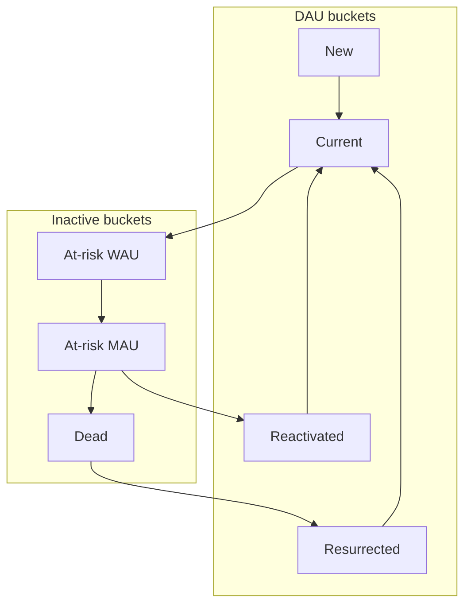

# User Email Machine — Proposal

> **Status:** Draft proposal (strategy spec, not implementation)  
> **Live engineer reference:** `/email-machine` on the Vercel dashboard (`public/email-machine.html`)  
> **Source notes:** [`User Email Machine.txt`](../User%20Email%20Machine.txt)  
> **Dashboard context:** [`Corporate Goals.txt`](../Corporate%20Goals.txt), live metrics via `main.py --baseline`  
> **Baseline snapshot:** 2026-05-24 (`reporting/baseline_snapshot.json`)

---

## 1. Executive summary

Oasis can run a **multi-provider, free-tier email stack** that maps each lifecycle stage to the cheapest provider with capacity left — stretching runway while we pursue **500 paid subscribers by Dec 31, 2026**, **4.5× DAU vs Product Hunt launch week**, and **80% gross margin**.

Adam’s initial five-sequence split (HubSpot welcome, Brevo NPS, Mailgun PMF, OmniSend upgrade thank-you, MailerLite at-risk nurture) is the right foundation. This proposal **preserves those five** as Phase 1 and adds sequences the dashboard already flags as high-leverage gaps:

- **Activation nudges** (32% 24h activation today — room to improve NURR before PH)
- **Limit-hitter upgrade** (direct path to paid subs; currently 0% limit-hitter conversion)
- **Dead resurrection** (95 dead users = 77.9% of base; Resurrection_Rate ≈ 0.3%)
- **Cancelled-sub win-back** (post-OmniSend cap at 250 paid)

The daily baseline dashboard (`dau_model` buckets + flow rates + `corporate_goals`) becomes the **control panel** for which cohorts get email slots when free-tier caps are tight.

---

## 2. DAU bucket model primer

The User Email Machine classifies every user into exactly one bucket per day. The top four buckets sum to **DAU**; the bottom three describe inactive users at different depths of churn.



| Bucket | Definition | Email role |
|--------|------------|------------|
| **New** | First day of engagement ever | Onboarding, activation |
| **Current** | Active today + at least one other day in prior 6 | Habit reinforcement (light touch) |
| **Reactivated** | First day back after 7–29 days away | Reinforce return; improve RURR |
| **Resurrected** | First day back after 30+ days away | Reinforce return; improve SURR |
| **At-risk WAU** | Inactive today, active in prior 6 days | Urgent re-engagement → **iWAURR** |
| **At-risk MAU** | Inactive 7+ days, active 7–29 days ago | Win-back before dead → **iMAURR** |
| **Dead** | No activity in 30+ days | Resurrection → **Resurrection_Rate** |

**Roll-ups:** At-risk WAU + DAU = WAU · At-risk MAU + WAU = MAU · Dead + MAU = total user base.

### Flow rates (levers)

These rates appear on the dashboard and in Key insights. Moving them grows DAU compounding over time.

| Rate | Transition | Baseline (May 24) |
|------|------------|-------------------|
| NURR | New → Current | 50.0% |
| 1-NURR | New → At-risk WAU | 50.0% |
| CURR | Current → Current | 25.8% |
| 1-CURR | Current → At-risk WAU | 74.2% |
| iWAURR | At-risk WAU → Current | **18.8%** |
| WAU_Loss_Rate | At-risk WAU → At-risk MAU | 6.0% |
| iMAURR | At-risk MAU → Reactivated | **2.3%** |
| MAU_Loss_Rate | At-risk MAU → Dead | 6.4% |
| Resurrection_Rate | Dead → Resurrected | **0.3%** |

**May 24 bucket snapshot (122 users):**

| Bucket | Count | % of base |
|--------|------:|----------:|
| Dead | 95 | 77.9% |
| At-risk WAU | 16 | 13.1% |
| At-risk MAU | 10 | 8.2% |
| Resurrected | 1 | 0.8% |
| DAU (sum of active buckets) | 1 | — |
| WAU | 17 | — |
| MAU | 27 | — |

**Implication:** Pre–Product Hunt, email priority should be **at-risk prevention** (26 recoverable users) and **resurrection** (95 dead), not broad current-user nurture.

---

## 3. Provider stack and free-tier constraints

| Provider | Free limit | Primary role (Adam’s draft) | Hard constraints |
|----------|------------|----------------------------|------------------|
| **HubSpot** | 2,000 marketing emails / month | Welcome (all new users) | No custom HTML; built-in templates only |
| **Brevo** | 300 emails / day · 2,000 contacts | NPS (all new users) | Also CS agent transactional ([`PLAN.md`](../PLAN.md)) |
| **Mailgun** | 100 emails / day | PMF (new WAU) | Transactional-oriented |
| **OmniSend** | 500 emails / month · **250 contacts** | Upgrade thank-you (Stripe) | **250 paid cap** — below 500 subs goal |
| **MailerLite** | 12,000 emails / month · **500 contacts** | At-risk nurturing | Contact ceiling, not send ceiling |

### Monthly send budget (theoretical max)

| Provider | Monthly send cap | Contact cap |
|----------|-----------------|-------------|
| HubSpot | 2,000 | — |
| Brevo | ~9,000 (300 × 30) | 2,000 |
| Mailgun | ~3,000 (100 × 30) | — |
| OmniSend | 500 | 250 |
| MailerLite | 12,000 | 500 |

### Pros / cons summary

| Provider | Best for | Watch out for |
|----------|----------|---------------|
| HubSpot | High-volume one-shot welcome at signup | Entire PH burst can consume one month |
| Brevo | Day-7 NPS + CS agent + limit-hitter overflow | Shared with agent sends; contact cap |
| Mailgun | WAU PMF survey | Lower daily cap than Brevo |
| OmniSend | Paid upgrade celebration | Hits 250 contacts before 500 subs goal |
| MailerLite | Multi-touch at-risk drips | 500 contacts fills fast post-PH |

---

## 4. Sequence catalog

Adam’s five sequences are **Phase 1 — approved draft**. Five additional sequences close gaps surfaced by the dashboard and corporate goals.

### Phase 1 — Adam’s foundation

| # | Sequence | Provider | Audience | Trigger | Cadence | Adam’s capacity runway |
|---|----------|----------|----------|---------|---------|------------------------|
| 1 | **Welcome** | HubSpot | All new signups | Account created / first bucket = new | One-time | Until new signups > **2,000/month** |
| 2 | **NPS** | Brevo | All new users | Day 7 post-signup | One-time | Until daily signups > **300/day** |
| 3 | **PMF survey** | Mailgun | New WAU-eligible users | First week with WAU activity | One-time | Until net new WAU/week > **100** |
| 4 | **Upgrade thank-you** | OmniSend | Stripe upgrades | New `user_plans` row (`paid_subscribers` +1) | One-time | Until **250 paid** ($5k MRR) |
| 5 | **At-risk nurture** | MailerLite | At-risk WAU + at-risk MAU | Bucket transition into at-risk | Drip (2–4 touches) | Until **500 dead/month inflow** (see §6) |

### Phase 1 additions (dashboard-driven)

| # | Sequence | Provider | Audience | Trigger | Cadence | Primary goal |
|---|----------|----------|----------|---------|---------|--------------|
| 6 | **Activation nudge** | HubSpot (overflow: Brevo) | Signups with no AI prompt in 24h | `activation_24h_pct` cohort; no `llm_usage` in first 24h | One-time (+ optional D3) | 4.5× DAU · NURR |
| 7 | **Limit-hitter upgrade** | Brevo (overflow: Mailgun) | Free users who hit token cap | `users_hit_limit` + not in `paid_subscribers` | One-time + D7 reminder | **500 subs** · `limit_hitter_conversion_pct` |
| 8 | **Dead resurrection** | MailerLite (capped queue) | Dead bucket, eligible | `bucket=dead` · not emailed in 30d · not 12mo absent | 2-touch campaign | 4.5× DAU · Resurrection_Rate |
| 9 | **Return reinforcement** | MailerLite | Reactivated / resurrected | First day in bucket | One-time | RURR · SURR · prevent 1-RURR / 1-SURR |
| 10 | **Cancelled sub win-back** | Brevo (post-250: paid tier) | `cancelled_paid_subscribers` | `user_plans.is_active=false` | One-time + D14 | **500 subs** · retention |

### Per-sequence detail

Each sequence should log to CS agent `outreach_log` (see [`PLAN.md`](../PLAN.md)) with `{user_id, trigger_name, channel: "email", provider}` to prevent duplicate sends.

#### 1. Welcome (HubSpot) — Adam

- **Audience:** Every new signup (including PH waitlist converts).
- **Send:** Within 1 hour of signup.
- **Success metrics:** `activation_24h_pct`, `flow_NURR`, `time_to_first_hours.median`.
- **Dedup:** Once per user (`trigger_name: welcome_email`).

#### 2. NPS (Brevo) — Adam

- **Audience:** All users day 7 post-signup who received welcome.
- **Success metrics:** Feedback submission rate; qualitative NPS trend.
- **Dedup:** Once per user (`nps_day7`).

#### 3. PMF survey (Mailgun) — Adam

- **Audience:** Users who become WAU-eligible in their first 7 days (active on 2+ days in first week).
- **Success metrics:** `latest_wau`, `multi_day_ai_first_7d_pct`.
- **Dedup:** Once per user (`pmf_wau_week1`).

#### 4. Upgrade thank-you (OmniSend) — Adam

- **Audience:** New Stripe subscribers (`user_plans.start_date >= 2026-05-24`).
- **Success metrics:** `paid_subscribers`, `active_paid_subscribers`, `corporate_goals.subscribers.month_target`.
- **Dedup:** Once per upgrade event.

#### 5. At-risk nurture (MailerLite) — Adam

- **Audience:** Priority queue — at-risk WAU first, then at-risk MAU. Cap dead resurrection separately (seq 8).
- **Success metrics:** `bucket_at_risk_wau`, `bucket_at_risk_mau`, `flow_iWAURR`, `flow_iMAURR`, `flow_MAU_Loss_Rate`.
- **Dashboard lever (verbatim):** *“Re-engage within 7 days — improve iWAURR before they slide to at-risk MAU or dead.”*
- **Dedup:** Max one nurture email per 7 days per user.

#### 6. Activation nudge (new)

- **Why:** Only **32%** of users activate within 24h today; PH may add 200–2,000 signups in ~3 days.
- **Audience:** Signups with zero `llm_usage` after 24h (and optional 72h follow-up).
- **Provider:** HubSpot if monthly budget remains; else Brevo transactional list.
- **Success metrics:** `activation.activation_rate_pct.24h`, `flow_NURR`, `flow_1-NURR` (lower is better).

#### 7. Limit-hitter upgrade (new) — critical for 500 subs

- **Why:** `premium_conversion_among_limit_hitters_pct` = **0%** at baseline; limit hitters are the highest-intent free users.
- **Audience:** Users in `users_hit_limit` who are not counted in `paid_subscribers`.
- **Message:** $20/mo value prop at moment of cap hit; optional D7 reminder if still free.
- **Provider:** Brevo (dedicated transactional list, separate from NPS marketing).
- **Success metrics:** `limit_hitter_conversion_pct`, `paid_subscribers` vs `month_target` (~17 in May 2026).

#### 8. Dead resurrection (new)

- **Why:** **95 dead users (77.9%)** with Resurrection_Rate ≈ **0.3%** — email is the primary win-back channel.
- **Audience:** Dead bucket; exclude users with 12+ months no login and no email opens (Adam’s hygiene rule).
- **Provider:** MailerLite contact slots (lowest priority after at-risk WAU/MAU when cap tight).
- **Cadence:** 2-email campaign (day 0 + day 14), then stop.
- **Success metrics:** `bucket_dead`, `flow_Resurrection_Rate`, `flow_MAU_Loss_Rate` (prevent new dead).

#### 9. Return reinforcement (new)

- **Audience:** Users entering reactivated or resurrected bucket.
- **Message:** “Welcome back” + one high-value use case.
- **Success metrics:** `flow_RURR`, `flow_SURR`, `flow_1-RURR`, `flow_1-SURR`.

#### 10. Cancelled sub win-back (new)

- **Audience:** `cancelled_paid_subscribers` (`user_plans.is_active=false`).
- **Provider:** Brevo after OmniSend contact cap; or OmniSend paid tier.
- **Trigger at:** 250 paid subs when OmniSend free tier is full.
- **Success metrics:** `active_paid_subscribers`, `cancelled_paid_subscribers`, net `paid_subscribers`.

---

## 5. Bucket × sequence × provider matrix

| Bucket | Primary sequences | Provider(s) | Flow rate to improve |
|--------|-------------------|-------------|----------------------|
| New | Welcome, Activation nudge, NPS (D7) | HubSpot, Brevo | NURR ↓ 1-NURR |
| Current | (Light touch only — defer until post-PH) | — | CURR ↑ 1-CURR ↓ |
| At-risk WAU | At-risk nurture | MailerLite | iWAURR ↑ |
| At-risk MAU | At-risk nurture | MailerLite | iMAURR ↑ |
| Dead | Dead resurrection | MailerLite (capped) | Resurrection_Rate ↑ |
| Reactivated | Return reinforcement | MailerLite | RURR ↑ 1-RURR ↓ |
| Resurrected | Return reinforcement | MailerLite | SURR ↑ 1-SURR ↓ |
| Limit hitters (cross-bucket) | Limit-hitter upgrade | Brevo / Mailgun | limit_hitter_conversion_pct ↑ |
| Paid (Stripe) | Upgrade thank-you | OmniSend → Brevo | paid_subscribers vs month_target |
| Cancelled paid | Cancelled win-back | Brevo (post-250) | active_paid_subscribers ↑ |

---

## 6. Capacity runway and upgrade triggers

### Capacity formulas

```
monthly_sends(provider) = Σ (eligible_users_in_cohort × emails_per_sequence)
runway_months             = free_monthly_limit / monthly_sends
upgrade_trigger           = runway_months < 2  OR  contacts > 0.8 × contact_cap
```

### Adam’s “500 dead users per month” — recalculated

Adam’s MailerLite threshold should measure **net inflow into dead**, not total dead count.

```
estimated_monthly_dead_inflow ≈ (MAU_Loss_Rate / 100) × at_risk_mau × 30
```

**May 24 baseline:** `(6.4 / 100) × 10 × 30 ≈ 19 users/month` flowing from at-risk MAU → dead.

MailerLite remains viable until inflow approaches **500/month** — i.e. ~10× current slide rate, or ~780 at-risk MAU at the same loss rate. The near-term constraint is the **500 contact cap**, not dead inflow.

### Scenario stress tests

#### A. Baseline (May 24 — pre-PH)

| Sequence | Eligible users | Sends/mo | Provider | Headroom |
|----------|---------------:|---------:|----------|----------|
| Welcome | ~0 new | 0 | HubSpot | Full |
| NPS | ~0 | 0 | Brevo | Full |
| At-risk nurture | 26 | ~52 (2×) | MailerLite | 500 contacts · 12k sends |
| Dead resurrection | 95 (cap 20/mo) | 40 | MailerLite | Contact-limited |
| Limit-hitter | 1 | 2 | Brevo | Full |
| Upgrade thank-you | 1 | 1 | OmniSend | Full |

**MailerLite contacts in use:** ~26 at-risk + 20 dead campaign = **46 / 500**.

#### B. PH low (+200 signups in launch week)

| Sequence | Sends | Provider | Risk |
|----------|------:|----------|------|
| Welcome | 200 | HubSpot | 10% of monthly cap |
| NPS (week 2+) | 200 | Brevo | OK (~29/day) |
| Activation nudge (~68% non-24h) | ~136 | HubSpot/Brevo | OK |
| PMF (est. 40% WAU-eligible) | ~80 | Mailgun | OK |

**Brevo contacts:** 122 + 200 = **322 / 2,000** — OK.

#### C. PH high (+2,000 signups in launch week)

| Sequence | Sends | Provider | Risk |
|----------|------:|----------|------|
| Welcome | **2,000** | HubSpot | **Entire monthly cap in one week** |
| NPS | 2,000 | Brevo | ~286/day — OK |
| Activation nudge | ~1,360 | HubSpot/Brevo | Brevo overflow required |
| PMF | ~800 | Mailgun | ~27/day — OK |

**Mitigations for PH high:**

1. **HubSpot overflow:** Queue welcome sends across May/June or route overflow welcome to Brevo transactional list.
2. **Brevo contacts:** 122 + 2,000 = **2,122** — **exceeds 2,000 contact cap**. Upgrade Brevo or prune 12-month dead before PH.
3. **MailerLite contacts:** Base + 2,000 >> 500 — **priority queue mandatory** (at-risk WAU only until upgrade).

#### D. Dec 2026 target (500 paid subs)

| Provider | Issue | Migration plan |
|----------|-------|----------------|
| OmniSend | Free tier caps at **250 contacts** | At **250 `paid_subscribers`**: move upgrade thank-you + cancelled win-back to **Brevo paid** or dedicated transactional provider |
| MailerLite | 500 contacts vs ~600+ user base | Upgrade MailerLite (~$10/mo) or split resurrection to 6th provider |
| HubSpot | 2,000/mo vs sustained new-user growth | Upgrade when monthly signups > 2,000 consistently (June milestone ~85 subs implies heavy acquisition) |
| Brevo | Agent + marketing + limit-hitter | Separate sub-account or paid tier for CS agent transactional |

### Known cliffs — summary

| Cliff | Trigger | Action |
|-------|---------|--------|
| HubSpot monthly exhaustion | PH high welcome burst | Brevo welcome overflow; batch across months |
| Brevo 2,000 contacts | PH high or Q3 growth | Prune dead; upgrade Brevo |
| OmniSend 250 paid | `paid_subscribers >= 250` (~Nov milestone 440) | Brevo for paid lifecycle emails |
| MailerLite 500 contacts | `contacts > 400` | Priority: at-risk WAU > MAU > dead resurrection |
| Brevo agent conflict | Agent sends + marketing compete | Dedicated transactional list / sub-account |

---

## 7. Dashboard KPI map — how we know it’s working

| Corporate goal | Dashboard fields | Sequences |
|----------------|------------------|-----------|
| **500 subs by Dec 31** | `paid_subscribers`, `month_target`, `gap_year_end`, `limit_hitter_conversion_pct`, `premium_conversion_pct` | Limit-hitter upgrade, upgrade thank-you, activation |
| **4.5× DAU vs PH week** | `dau_multiple`, `bucket_*`, `flow_NURR`, `flow_iWAURR`, `flow_Resurrection_Rate` | Welcome, activation, at-risk nurture, resurrection |
| **80% gross margin** | `gross_margin_pct`, `estimated_api_cost_usd` | Stay on free tiers; upgrade only when capacity triggers fire |

### Sequence → metric checklist

| Sequence | Primary KPI | Secondary KPI | Insight lever |
|----------|-------------|---------------|---------------|
| Welcome | `activation_24h_pct` | `flow_NURR` | PH launch activation |
| Activation nudge | `activation_24h_pct` | `flow_1-NURR` ↓ | Maximize 24h activation before PH |
| NPS | `feedback_submission_rate_pct` | — | — |
| PMF | `latest_wau` | `multi_day_ai_first_7d_pct` | — |
| Limit-hitter upgrade | `limit_hitter_conversion_pct` | `paid_subscribers` vs `month_target` | Subscriber goal gap |
| At-risk nurture | `flow_iWAURR`, `flow_iMAURR` | `bucket_at_risk_wau` ↓ | Re-engage within 7 days |
| Dead resurrection | `flow_Resurrection_Rate` | `bucket_dead` ↓ | Run win-back campaigns |
| Upgrade thank-you | `active_paid_subscribers` | — | — |
| Cancelled win-back | `cancelled_paid_subscribers` ↓ | `paid_subscribers` | — |

Monitor weekly deltas on: `bucket_at_risk_wau`, `bucket_dead`, `flow_Resurrection_Rate`, `paid_subscribers` vs `corporate_goals.subscribers.month_target`.

---

## 8. Contact hygiene and compliance

From Adam’s draft, extended:

1. **12-month absence rule:** If no Supabase login AND no email opens for 12 months → mark dead, remove from MailerLite and Brevo marketing lists (retain in Supabase for analytics unless legally required to delete).
2. **Unsubscribe:** Honor per-provider unsubscribe; sync suppression list across HubSpot, Brevo, MailerLite.
3. **Dedup:** CS agent `outreach_log` — never send same `trigger_name` twice to same user.
4. **Priority when contact caps bind:** At-risk WAU → at-risk MAU → limit hitters → dead resurrection (newest dead first, cap 20/month).
5. **Paid users:** Remove from free nurture sequences; route to OmniSend/Brevo paid lifecycle only.

---

## 9. CS agent integration notes

The CS agent ([`PLAN.md`](../PLAN.md)) already uses **Brevo** for transactional email and team alerts. This proposal adds **four other marketing providers**.

| Concern | Recommendation |
|---------|----------------|
| Brevo dual use | Separate lists: `brevo-transactional-agent`, `brevo-nps`, `brevo-limit-hitter`. Consider a second Brevo free account for marketing. |
| Trigger logic | CS agent rule-based triggers (`triggers/evaluate.py`) should map 1:1 to sequences above. Claude generates copy only; never decides who gets email. |
| `outreach_log` | Single dedup table across all providers. |
| Daily run | Agent batch classifies users → evaluates triggers → routes to provider queue → logs send. |
| Reporting | Extend cohort report with emails sent per provider vs free-tier budget remaining. |

---

## 10. Phased rollout

### Phase 0 — Pre-PH (now → May 26)

- [ ] Stand up MailerLite; launch **at-risk WAU nurture** for 16 users.
- [ ] Pilot **dead resurrection** (cap 20 users, 2-touch).
- [ ] Wire **limit-hitter upgrade** for the 1 current limit hitter + future hits.
- [ ] Confirm HubSpot welcome template; Brevo NPS template.
- [ ] Prune Brevo/MailerLite lists to maximize contact headroom before PH.

### Phase 1 — PH week (May 27 ± 3 days)

- [ ] Welcome via HubSpot for all new signups; monitor daily send count vs 2,000 cap.
- [ ] Activation nudge at 24h for non-prompt users.
- [ ] Pre-written overflow: if HubSpot > 1,500 sends in month, switch new welcomes to Brevo.
- [ ] Daily dashboard review: `bucket_at_risk_wau`, `activation_24h_pct`, `total_users`.

### Phase 2 — Post-PH (Jun → Sep)

- [ ] NPS day-7 and PMF for new cohorts.
- [ ] Scale limit-hitter upgrade as `token_limit_hit_rate_pct` rises.
- [ ] Track `paid_subscribers` vs monthly milestones (85 Jun, 156 Jul, …).
- [ ] At 250 paid: migrate upgrade thank-you off OmniSend free tier.

### Phase 3 — Scale to 500 subs (Oct → Dec)

- [ ] Upgrade providers as capacity triggers fire (§6).
- [ ] Cancelled sub win-back live.
- [ ] Monthly review: gross margin vs email tool spend (target 80% margin).

---

## 11. Open decisions

| # | Question | Options |
|---|----------|---------|
| 1 | Dead resurrection provider when MailerLite full? | MailerLite upgrade · 6th free provider · Brevo campaign |
| 2 | HubSpot PH overflow? | Brevo welcome clone · Paid HubSpot · Delay welcome 24h batching |
| 3 | OmniSend post-250? | Brevo paid lifecycle · Keep OmniSend paid (~$16/mo) |
| 4 | Activation D3 follow-up? | Yes (doubles HubSpot/Brevo sends) · No (single 24h nudge only) |
| 5 | Current-user nurture? | Defer until DAU > PH baseline · Never (in-app only) |
| 6 | Budget vs margin at upgrade time? | Approve when `runway_months < 2` · Hard cap on email SaaS spend |

---

## Shipped templates (Brevo)

Live HTML previews and **project charter**: **[`/email-machine`](/email-machine)** (DAU buckets, strategy vs shipped providers, capacity panel, copy HTML).

Where **deployed** Brevo automations differ from the multi-provider **strategy** below, the engineer reference shows both (`deployed_via: brevo` on shipped sequences).

| Sequence | Strategy provider | Shipped | Trigger (deployed) |
|----------|-------------------|---------|-------------------|
| Welcome | HubSpot | **Brevo** — `brevo-oasis-welcome.html` | On signup |
| NPS | Brevo (day 7 in strategy) | **Brevo** — `brevo-oasis-nps-day3.html` | **Day 3** after signup |
| PMF | Mailgun (WAU week 1) | **Brevo** — `brevo-oasis-pmf-day10.html` | **Day 10** after signup |
| Upgrade thank-you | OmniSend | **Brevo** — `brevo-oasis-paid-zen-welcome.html` | Stripe paid (Zen plan) |
| PH teaser / launch | — (acquisition) | **Brevo** — `ph-waitlist/` | Waitlist / launch day (reusable funnel) |

See [`brevo-oasis-emails/lifecycle/brevo-oasis-lifecycle-emails.md`](../brevo-oasis-emails/lifecycle/brevo-oasis-lifecycle-emails.md) for automation details.

### Near-limit tracking (`email_provider_capacity`)

The baseline snapshot includes **`email_provider_capacity`**: per-provider contact/send usage vs free-tier caps. Alerts fire at **80%** of limit or **&lt;2 months runway** (proposal §6).

| Code | Meaning |
|------|---------|
| `NEAR_LIMIT_CONTACTS` | Marketing contacts ≥80% of provider cap |
| `NEAR_LIMIT_SENDS_MONTHLY` | Projected monthly sends ≥80% of cap |
| `NEAR_LIMIT_SENDS_DAILY` | Projected daily sends ≥80% of cap |
| `NEAR_LIMIT_RUNWAY` | Runway &lt;2 months at current send rate |
| `AT_LIMIT_*` | Same metrics at ≥100% |

Surfaced on: main dashboard KPI row, Key insights, and [`/email-machine#provider-capacity`](/email-machine).

v1 uses DAU bucket estimates; replace with `outreach_log` counts when CS agent Phase 4 ships.

---

## Appendix A — Adam’s original proposal (preserved)

From [`User Email Machine.txt`](../User%20Email%20Machine.txt):

1. **Welcome** — HubSpot — until new signups > 2,000/month  
2. **NPS** — Brevo — until daily signups > 300/day  
3. **PMF** — Mailgun — until net new WAU/week > 100  
4. **Upgrade thank-you** — OmniSend — until 250 paid ($5k MRR)  
5. **At-risk nurture** — MailerLite — until 500 dead/month inflow (recalculated in §6)  
6. **Hygiene** — Remove from Supabase + MailerLite after 12 months absence with no opens/login  

---

## Appendix B — Related docs

- [`User Email Machine.txt`](../User%20Email%20Machine.txt) — source bucket definitions and provider notes  
- [`Corporate Goals.txt`](../Corporate%20Goals.txt) — 500 subs, 80% margin, 4.5× DAU  
- [`Launch KPIs.txt`](../Launch%20KPIs.txt) — activation, retention, monetization KPIs  
- [`PLAN.md`](../PLAN.md) — CS agent pipeline and Brevo transactional  
- [`reporting/dau_model.py`](../reporting/dau_model.py) — bucket classification code  
- [`reporting/insights.py`](../reporting/insights.py) — Key insights levers  
