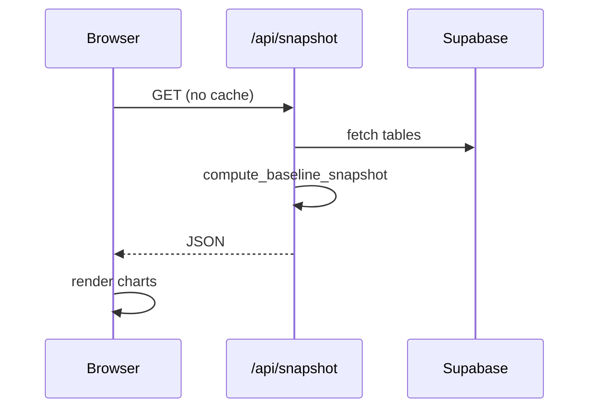

# Deploy the baseline dashboard on Vercel

## How it works (production)

Reloading [https://oasis-analytics.vercel.app](https://oasis-analytics.vercel.app) fetches **live metrics** from Supabase:

- **Static shell:** `public/index.html` (deployed from `public/`)
- **Live data:** [`api/snapshot.py`](../api/snapshot.py) serverless function
- **Fallback:** `./baseline_snapshot.json` when API is unavailable (local `npx serve public`)

Streamlit (`main.py --baseline-view`) remains for local interactive use only.

---

## Required Vercel settings

| Setting | Value |
|---------|--------|
| **Framework Preset** | Other |
| **Root Directory** | `./` |
| **Install Command** | *(empty)* — deps from [`api/requirements.txt`](../api/requirements.txt) only (httpx + pandas, no supabase-py) |
| **Build Command** | `python reporting/build_static_site.py` |
| **Output Directory** | `public` |

The build script copies `baseline_snapshot.json` into `public/` and **syncs email HTML previews**: for each sequence with `preview.source` in `email_sequences.json`, it wraps the Brevo fragment from `brevo-oasis-emails/` and writes `public/emails/<sequence_id>.html` (gitignored; regenerated every deploy).

[`vercel.json`](../vercel.json) sets these plus `maxDuration: 60` for the API.

### Environment variables (required for live dashboard)

Add in **Vercel → Project → Settings → Environment Variables** for **Production** (and Preview if desired):

| Key | Value |
|-----|--------|
| `SUPABASE_URL` | `https://xxxx.supabase.co` |
| `SUPABASE_KEY` | Supabase **service role** key (server-side only) |

Optional:

| Key | Value | Default |
|-----|--------|---------|
| `SNAPSHOT_CACHE_SECONDS` | `60` | `0` (every refresh hits Supabase) |
| `SNAPSHOT_DEBUG` | `true` | off (include stack trace in API errors) |

Redeploy after adding or changing env vars.

**Gemini cost input:** The live dashboard lets viewers enter actual monthly Gemini spend from AI Studio. Values persist in the browser only (`localStorage` keys `oasis_gemini_monthly_usd`, `oasis_supabase_monthly_usd`); they are not stored in Supabase. Optional future: persist to a config table for shared defaults.

### KPI history and deltas

Apply migration [`supabase/migrations/20260524120000_baseline_metric_history.sql`](../supabase/migrations/20260524120000_baseline_metric_history.sql) (creates `baseline_metric_history`). Each baseline run or live API response upserts one compact JSON row per calendar day. The dashboard shows **Key insights**, metric **tooltips**, and **daily / weekly / monthly deltas** (including DAU buckets and flow rates).

Until history accumulates, delta badges show “—”. Run `.venv/bin/python main.py --baseline` daily for best results. Optional: Vercel Cron hitting `/api/snapshot` once per day as a backup.

---

## Verification

1. Open `https://oasis-analytics.vercel.app/api/snapshot` — JSON with `generated_at` and metrics.
2. Open the main URL — header shows **Last updated** and **Source: live (Supabase)**.
3. Open `/email-machine` — engineer reference for DAU buckets, triggers, and free-tier email providers (data from `public/email_sequences.json`). The **Email previews** gallery shows rendered Brevo templates when the build step synced `public/emails/*.html`.
4. Hard-refresh — `generated_at` should reflect a new pull.
5. If API returns `{"error":"Missing environment variable: ..."}` — add secrets in Vercel and redeploy.

---

## Local development

| Mode | Command |
|------|---------|
| Static preview (cached JSON) | `.venv/bin/python reporting/build_static_site.py` then `npx serve public` |
| Full stack (live API) | `vercel dev` with `.env` containing `SUPABASE_URL` + `SUPABASE_KEY` |
| Refresh snapshot file | `.venv/bin/python main.py --baseline` |
| Streamlit | `.venv/bin/python main.py --baseline-view` |

Copy [`.env.example`](../.env.example) to `.env` (gitignored). Same variables as Vercel.

---

## Troubleshooting

| Symptom | Fix |
|---------|-----|
| Dashboard shows API error | Set `SUPABASE_URL` / `SUPABASE_KEY` on Vercel; redeploy |
| Bundle size &gt; 500MB | Ensure deploy uses latest `main` with `.vercelignore` (excludes `uv.lock` / `pyproject.toml`) |
| Build installs `supabase` / `pyiceberg` | Same — Vercel was using full `uv.lock`; ignored on deploy after `.vercelignore` |
| API times out | Hobby plan 10s limit — upgrade Pro or optimize fetches; `maxDuration` is 60 in `vercel.json` (Pro) |
| Slow first load | Cold start + Supabase fetch; normal for ~100+ users |
| Uses cached file locally | Expected without `vercel dev`; API not running |

---

## Security

- Service role key never leaves the serverless function.
- `/api/snapshot` is public (aggregate metrics only). Add Vercel Password Protection or auth later if needed.

---

## Optional: commit snapshot to git

`main.py --baseline` still writes `reporting/baseline_snapshot.json` for offline preview and CI. Production does **not** require committing JSON for updates — URL refresh pulls live data.
